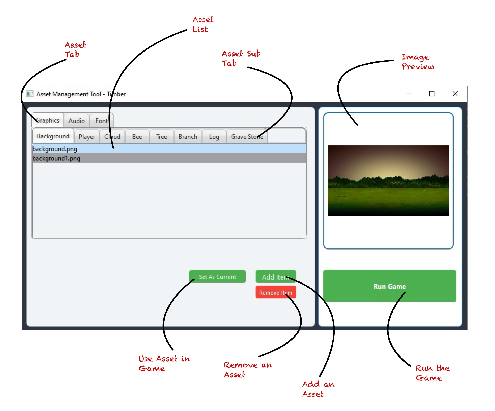

# Timber Asset Management Tool

## **Description**

This is an intuitive and efficient asset management tool tailored for, enabling seamless handling and organization of assets for the game *Timber*. The tool streamlines the management of images, sounds, and fonts, making it easy to integrate and manage assets during the game development process.

---

## **Purpose of the Asset Management Tool for Games**
Managing assets, such as images, audio files, and fonts, is critical for game development. This tool simplifies the handling of these assets, providing a user-friendly interface to preview, add, remove, and highlight assets that are currently in use by the game. By automating and streamlining these processes, game developers can focus on the core development of their game while reducing manual work related to asset management.

---

## **Features**

### 1. Image Preview
The tool provides an image preview option that allows users to quickly view the images associated with their game assets.

### 2. Loading Currently Available Assets from the Folder
Assets from your game’s directory are automatically loaded, allowing you to manage them directly from the tool.

### 3. Highlighting Currently Used Assets in the Game
The tool highlights assets currently used in the game based on the asset configuration file, helping you easily differentiate between used and unused assets.

### 4. Adding an Item
Add new items to your game’s asset folder, such as graphics or sound effects, through a simple user interface.

### 5. Removing an Item
Easily remove unused or redundant assets from the game’s directories.

### 6. Set as Current
Mark any asset as the current asset used in the game with just one click.

### 7. Run Game
Launch the game directly from the asset management tool using the "Run Game" button, reducing the need to switch between applications.

---

## **Tech Used**
- **Programming Language**: C++
- **Framework**: Qt for GUI
- **Game Engine**: SFML (Simple and Fast Multimedia Library)
- **Asset Handling**: JSON for asset Configuration
- **Development Environment**: Visual Studio
---

## Future Updates

The following enhancements are planned for future releases:
- More Attractive UI
- Dynamic Fetching of Parent Assets
- Merging Timber and Asset Management Tool Folders

---

**JIRA Link** - 

---
